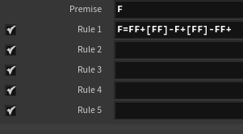
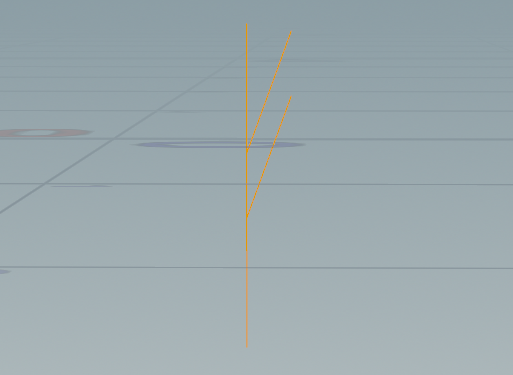
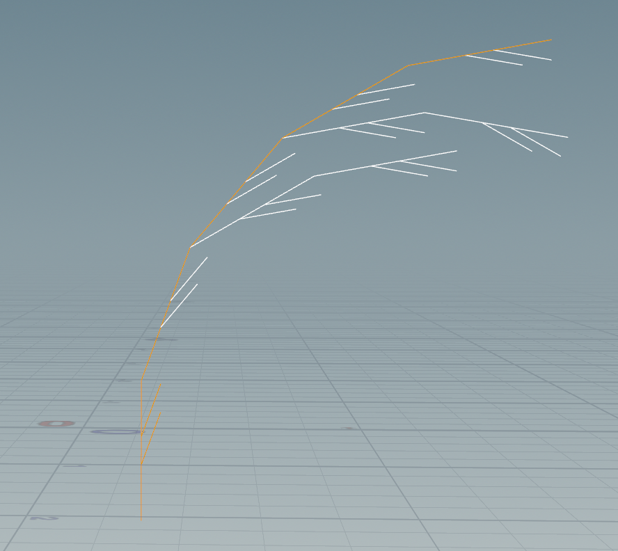
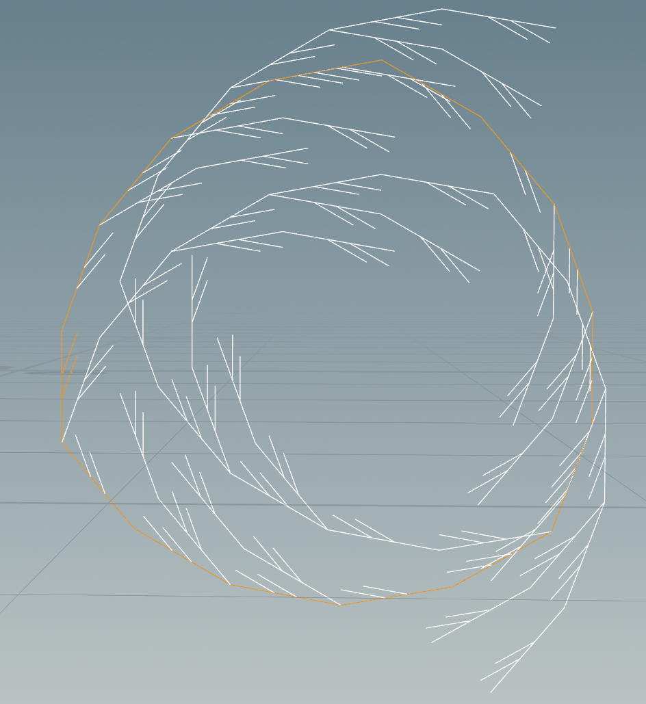
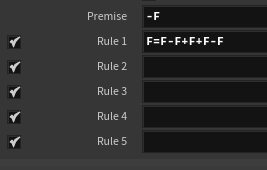
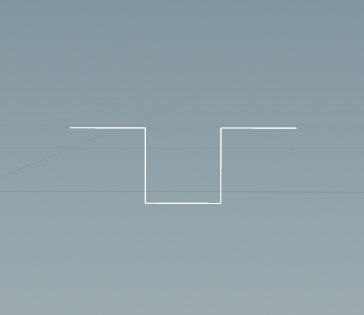
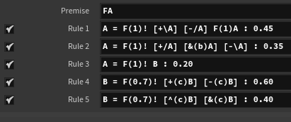
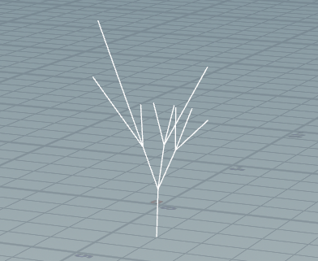
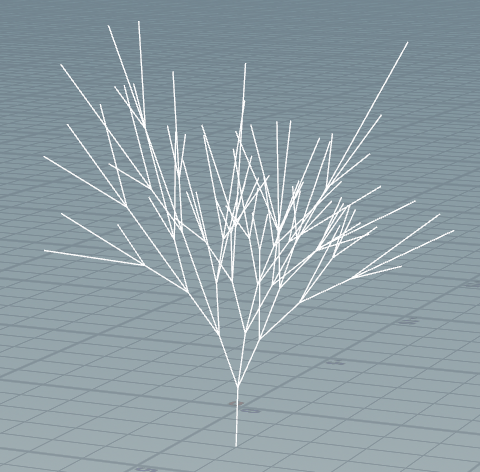
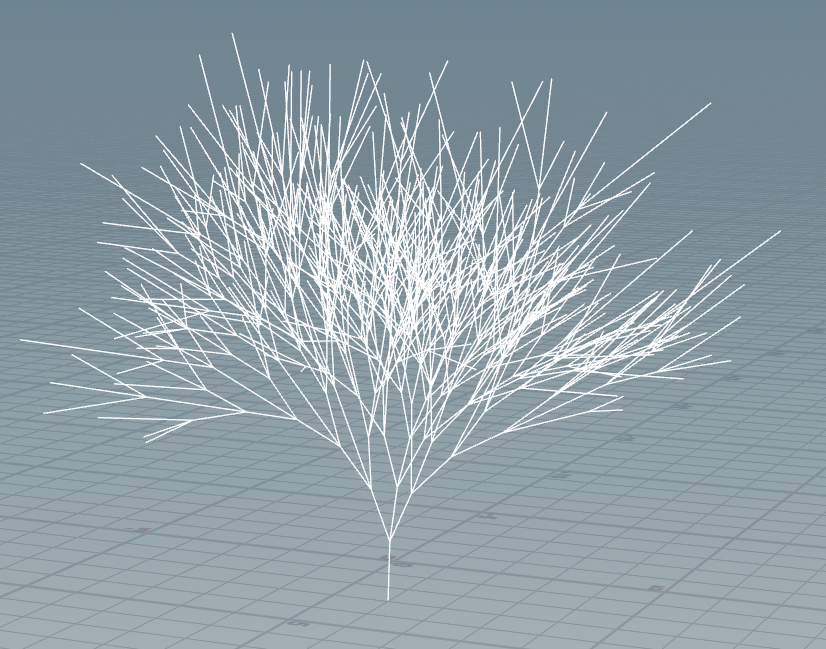

# lab04-grammars
A practice of using L-system grammars in Houdini.

## 1. Wheat grammar puzzle
Look at these iterations (n = 1, 2, 3) of a one-rule grammar. Using the built in symbols in Houdini, design a grammar that produces this output.\

My solution:\

Result images:\
\
\

## 2. Square grammar puzzle
Recreate these ones as well.\

My solution:\

Result images:\
\
\

## 3. Custom plant
My system:\
\
The first 3 rules are for the trunk A:
  1. With a 45% chance, grow forward, narrow the trunk, then create two angled trunks (one bends upward with a roll, the other downward with an opposite roll). At the end, extend the trunk again.
  2. With a 35% chance, grow forward, narrow the trunk, then split into three: one rolls right, one pitches downward by b degree, and one rolls left.
  3. With a 20% chance, extend the trunk and attach a branch B at the end.

The other 2 rules are for the branch B:
  1. With a 60% chance, grow forward in a shorter distance, narrow the branch, then fork into two side twigs at plus and minus c degrees.
  2. With a 40% chance, grow forward in a shorter distance, narrow the branch, then split upward and downward around the vertical axis by c degrees.

Result images:\
\
\

