# lab04-grammars

In this lab we practiced using L_system nodes in houdini by designing grammars to replicate certain outputs.

## 1. Wheat grammar puzzle

Reference

||||
|:--:|:--:|:--:|
|*Reference n = 1*|*Reference n = 2*|*Reference n = 3*|

Solution:
* Premise: F
* Rule: F = F=FF[+FF]F[+FF]FF+

|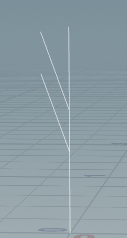|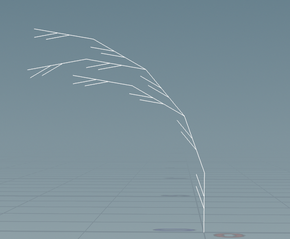|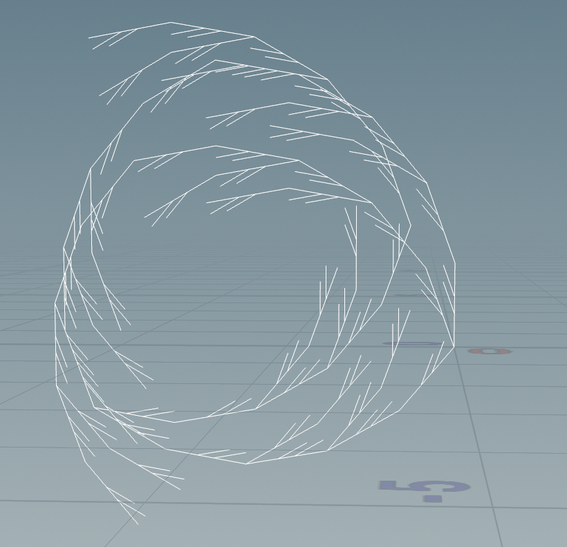|
|:--:|:--:|:--:|
|*Solution n = 1*|*Solution n = 2*|*Solution n = 3*|

## 2. Square grammar puzzle

Reference
||||
|:--:|:--:|:--:|
|*Reference n = 1*|*Reference n = 2*|*Reference n = 3*|

Solution:
* Premise: -F
* Rule: F=F-F+F+F-F

|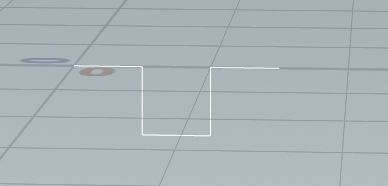|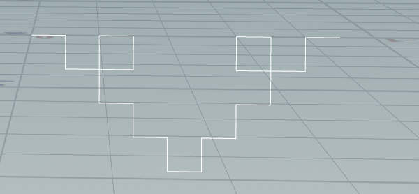|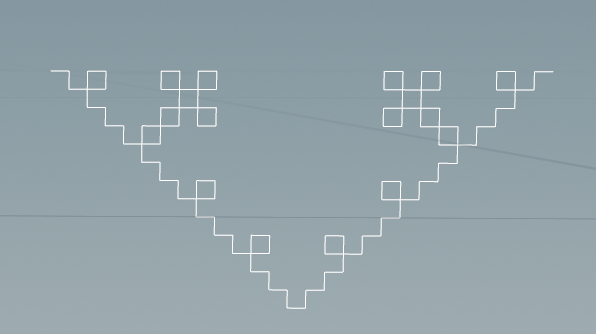|
|:--:|:--:|:--:|
|*Solution n = 1*|*Solution n = 2*|*Solution n = 3*|

## 3. Custom plant

For the last part, I chose a custom plant and designed a grammar to mimic it's structure. Here's some reference images of oak trees:

||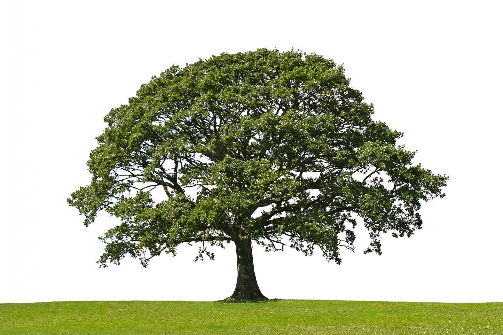|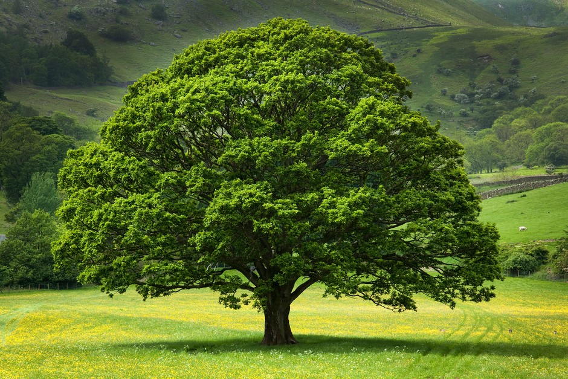|
|:--:|:--:|:--:|
||||

And here are some pictures of my L system

* Premise: X
* Rule 1: (Trunk branching) X = F [+Y] [-Y]
* Rule 2: Y = FFBF
* Rule 3: (Fan branching shape) B =  [ /(0) &(35) F(0.20) X] [ /(36) &(35) F(0.20) X]
     [ /(72) &(35) F(0.20) X] [ /(108) &(35) F(0.20) X]
     [ /(144) &(35) F(0.20) X] [ /(180) &(35) F(0.20) X]
     [ /(216) &(35) F(0.20) X] [ /(252) &(35) F(0.20) X]
     [ /(288) &(35) F(0.20) X] [ /(324) &(35) F(0.20) X]

|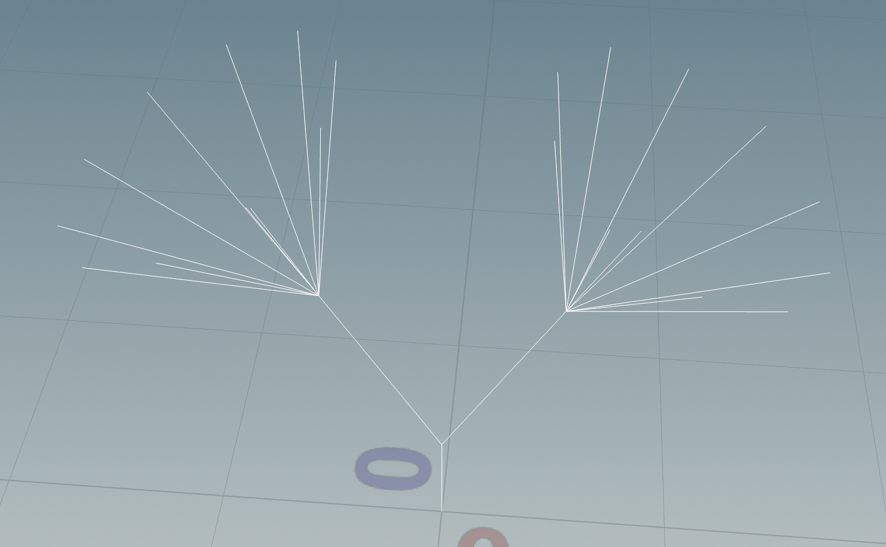|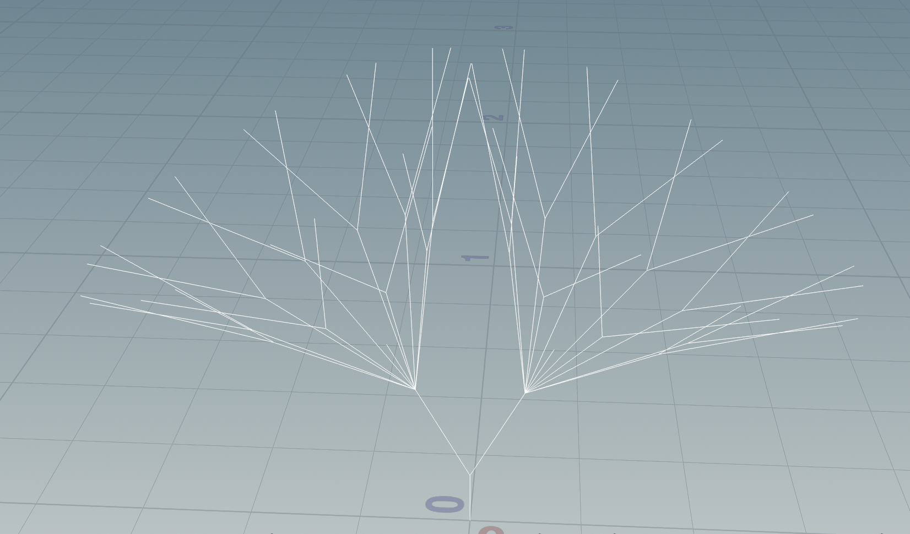|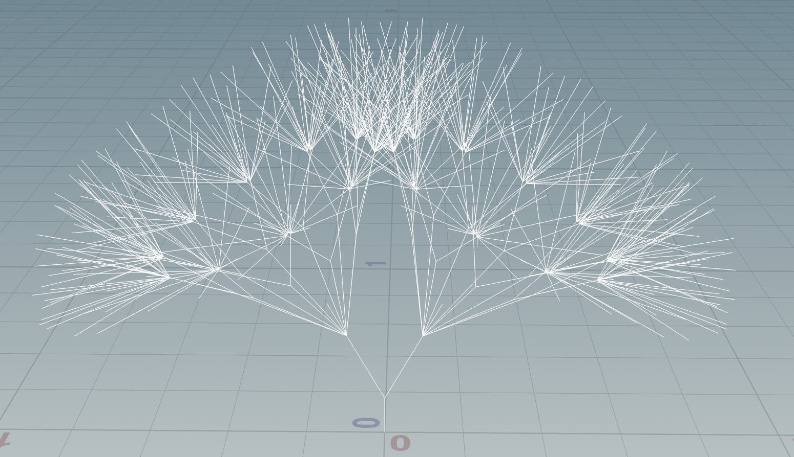|
|:--:|:--:|:--:|
|*Tree n = 3*|*Tree n = 5*|*Tree = 7*|

|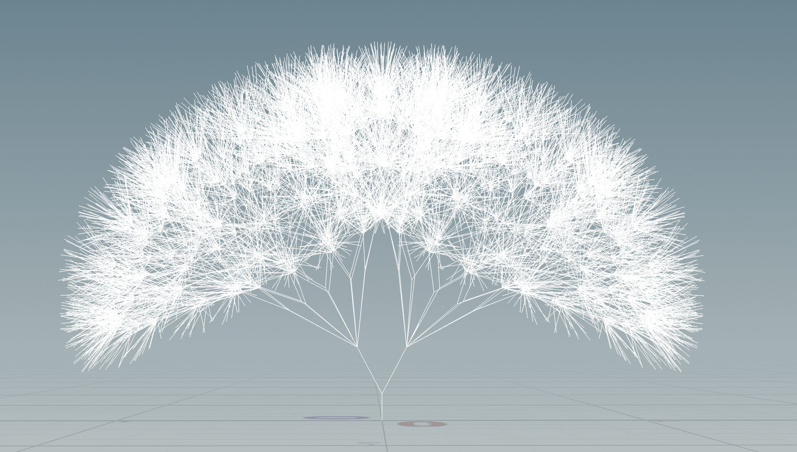|
|:--:|
|*Tree n = 9*|
