# lab04-grammars
Let's practice using grammars! For this lab, please pull up the L-system node in Houdini.

## Result
### Puzzle 1
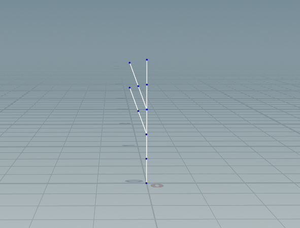 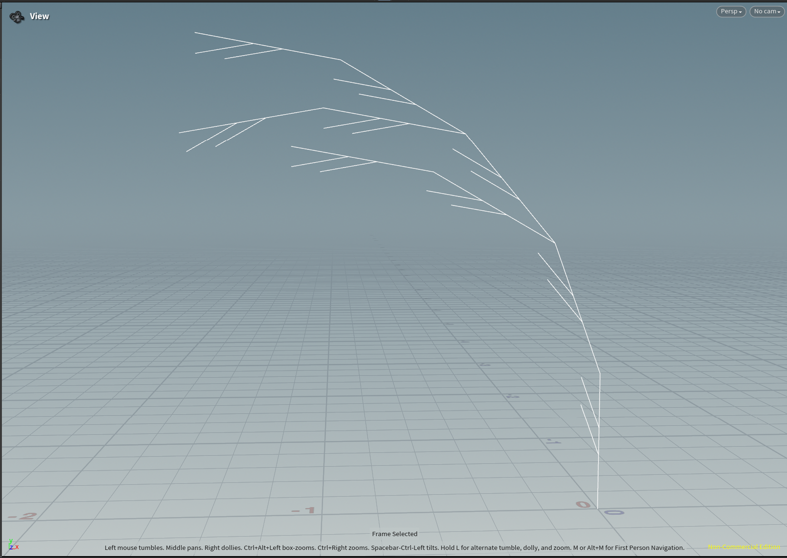 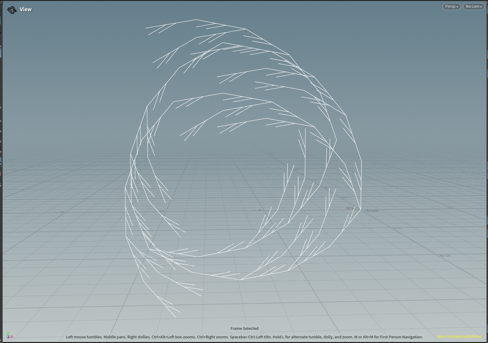

Rules:
```
Premise: F
Rule 1: F=FF[+FF]F[+FF]FF+
Angle: 20
```

### Puzzle 2
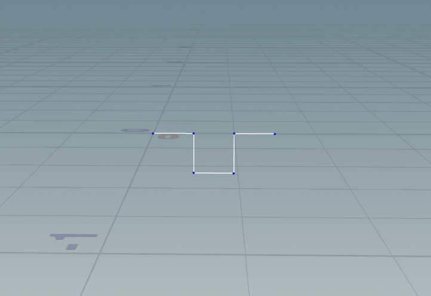 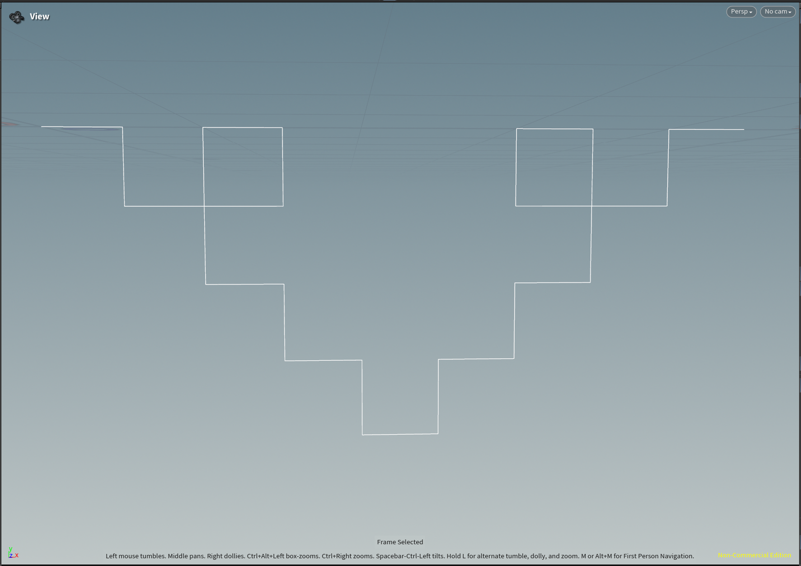 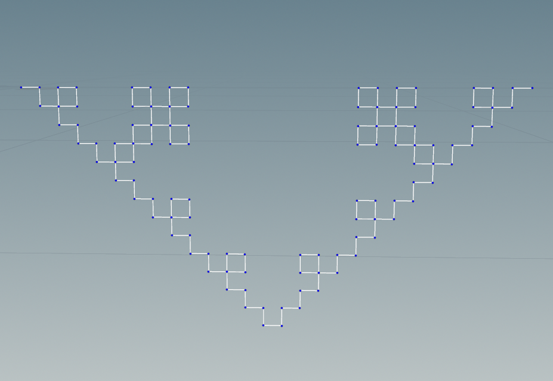

Rules:
```
Premise: -F
Rule 1: F=F-F+F+F-F
Angle: 90
```

### Custom plant
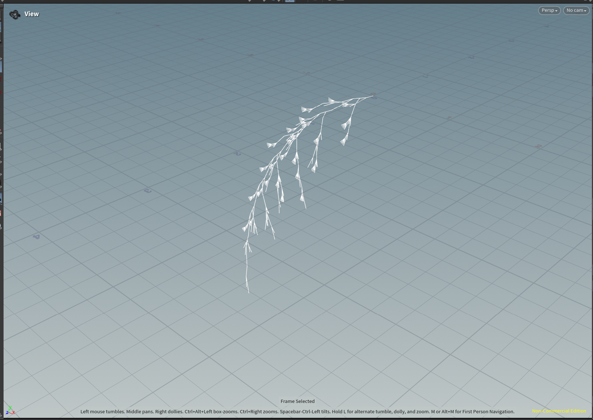
This picture shows the l-system's generation when iteration = 8.

I divided the tree into two main components: the **trunk** and the **branches**. At the end of each trunk segment, 3 branches evenly spaced in three directions grow outwards. Each branch then generates two smaller branches. In my rules, `A` represents a trunk layer which includes 3 branches at that level. `A` repeats itself recursively at the end so that the tree can continue growing. `B` represents a branch that includes two smaller branches. It also repeats itself at the end of each smaller branch.

I applied randomization at several points within the rules to increase variation. I also utilized Houdini's convention - putting `!` before a parameter makes its thickness depend on the number of generations.

My rules are:
```
Premise: ~(5)F~(5)FA
Rule 1: A = !~(5)F~(5)F~(5)F~(5)F[+B]\(b)[+B]\(b)[+B]A
Rule 2: B = ~(20)!F[\+(c)FB][\-(c)FB]
```

Variables:
```
Angle: 75
Variable b: 120
Variable c: 15
```

Generations from different iterations:
| 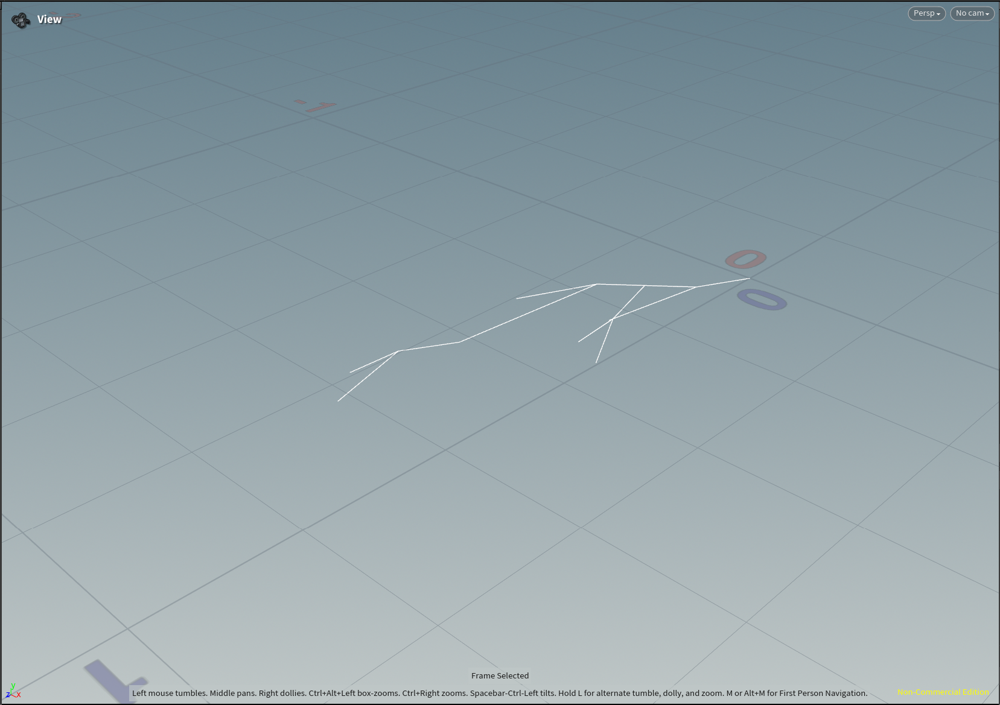  | 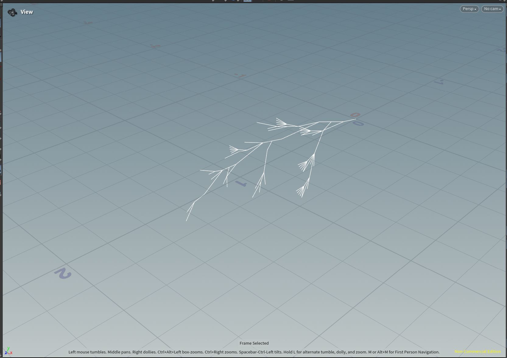 | 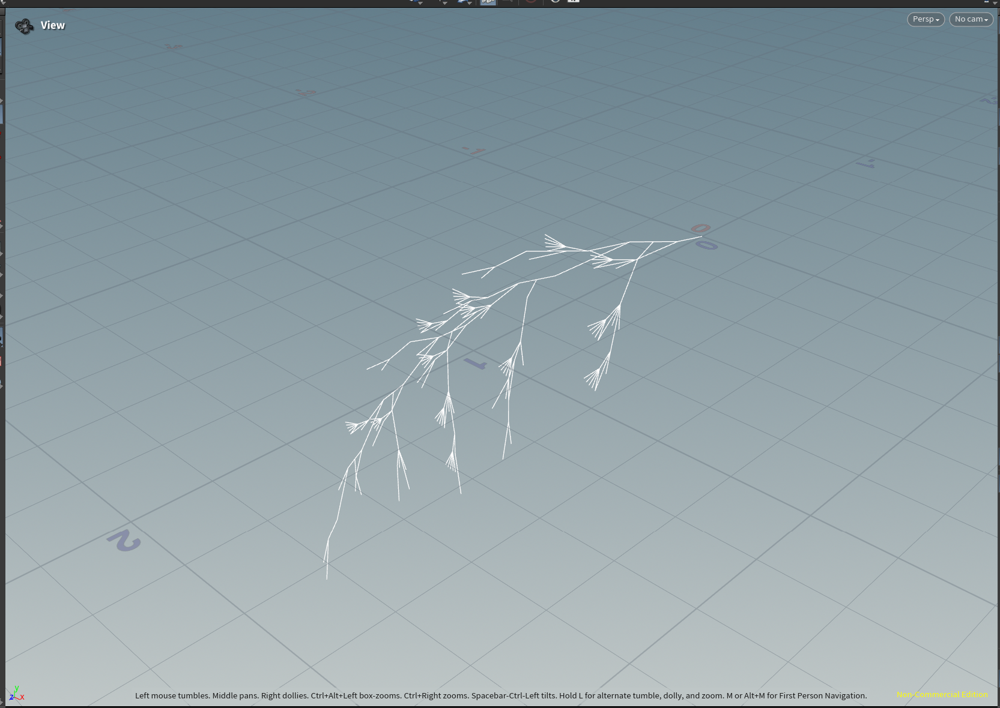 | 
|:--:|:--:|:--:|
| *iteration=5* | *iteration=6* | *iteration=7* |

Generations with different seeds (iteration = 8):
| 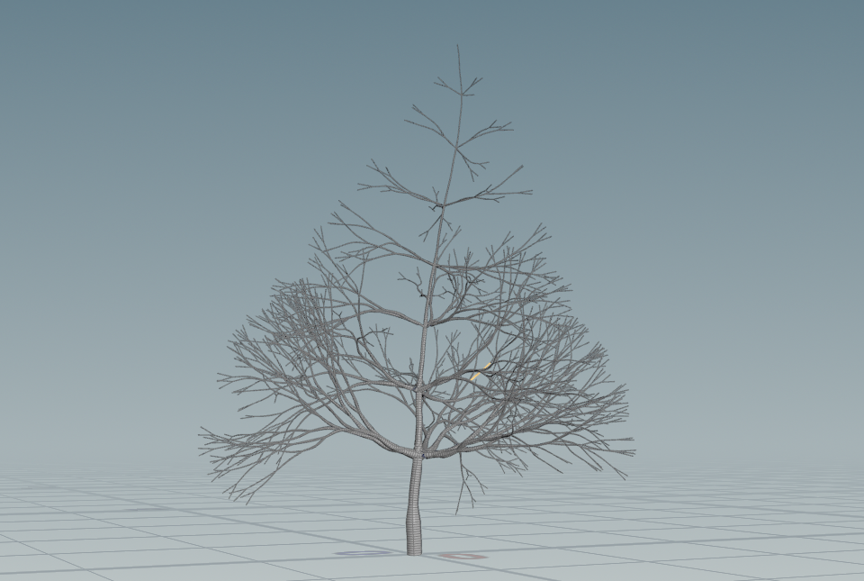  | 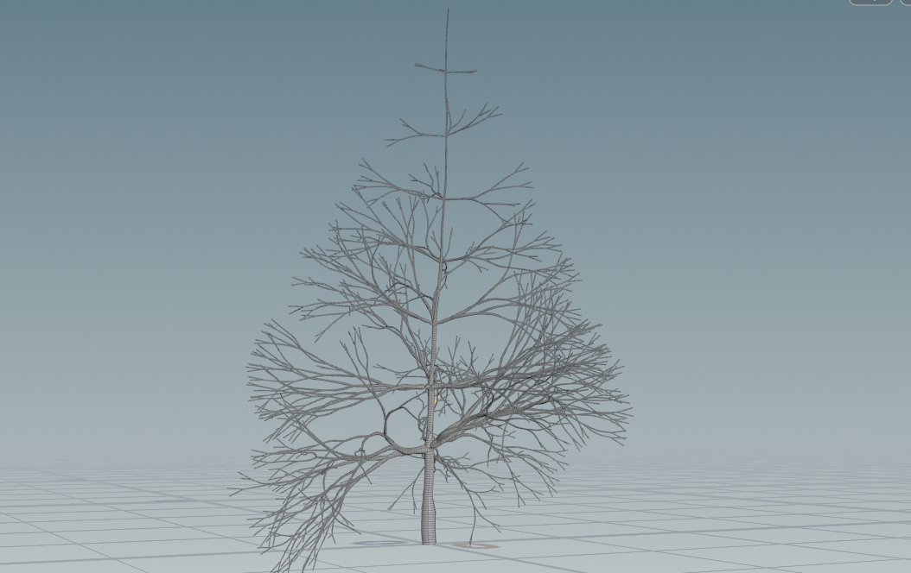 | 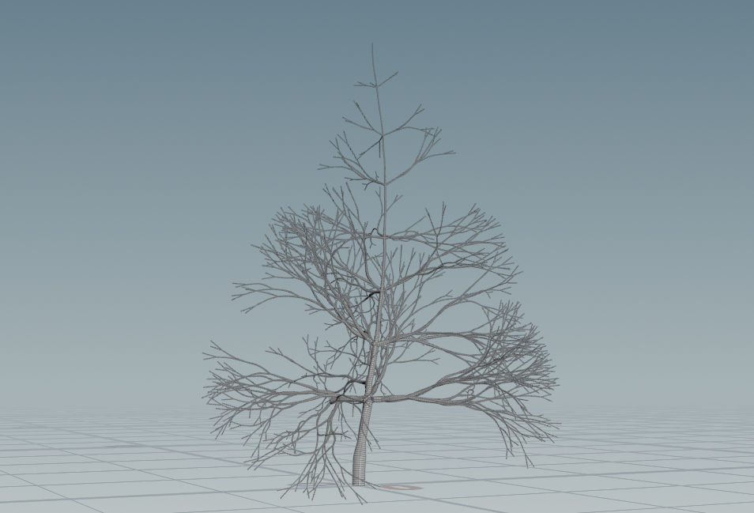 | 
|:--:|:--:|:--:|
| *seed 1* | *seed 2* | *seed 3* |

## 1. Wheat grammar puzzle
Look at these iterations (n = 1, 2, 3) of a one-rule grammar. Using the built in symbols in Houdini, design a grammar that produces this output. Take a screenshot of your rules.\


## 2. Square grammar puzzle
How about this one? Take a screenshot of your rules.\


## 3. Custom plant
Choose a plant in the world. Working off a reference, design a grammar that mimics the structure of that plant. Unlike our simple puzzles, please use multiple rules for greater complexity. Think carefully about the structure of your grammar! EXPLAIN the structure of your plant in the README. What are the components? What do each of the rules do? Be sure to also include images of a few iterations of your output plant. 

## Submission
- Create a pull request against this repository
- In your readme, list your solutions and format your README nicely
- Profit
