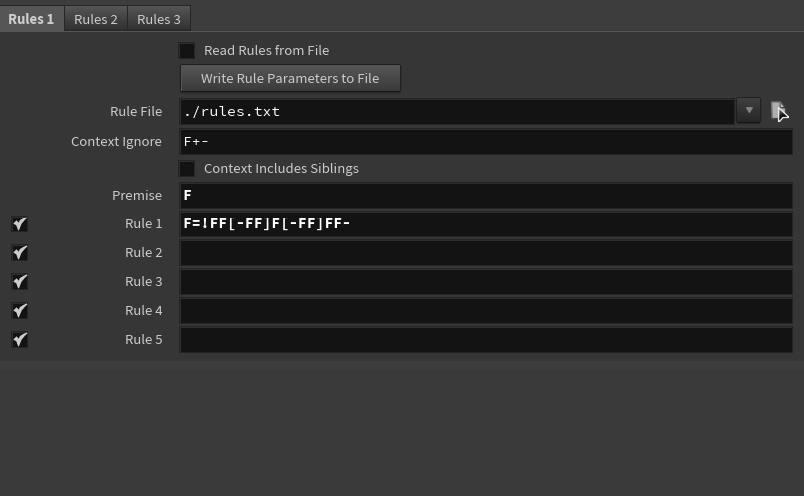
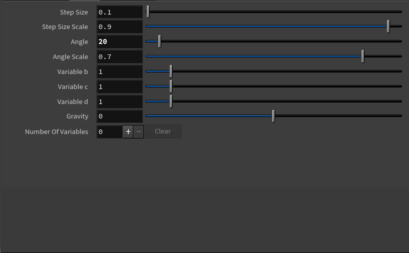
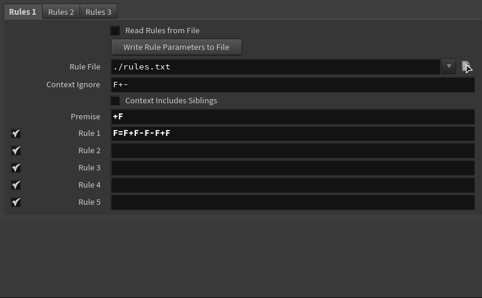
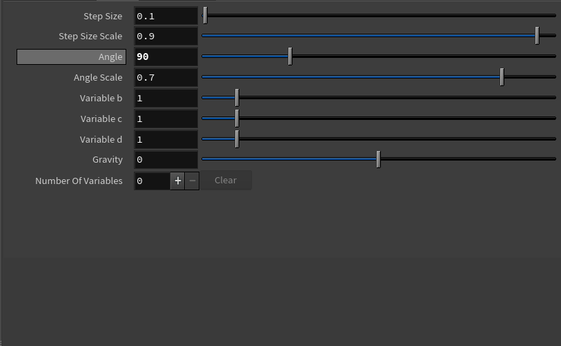
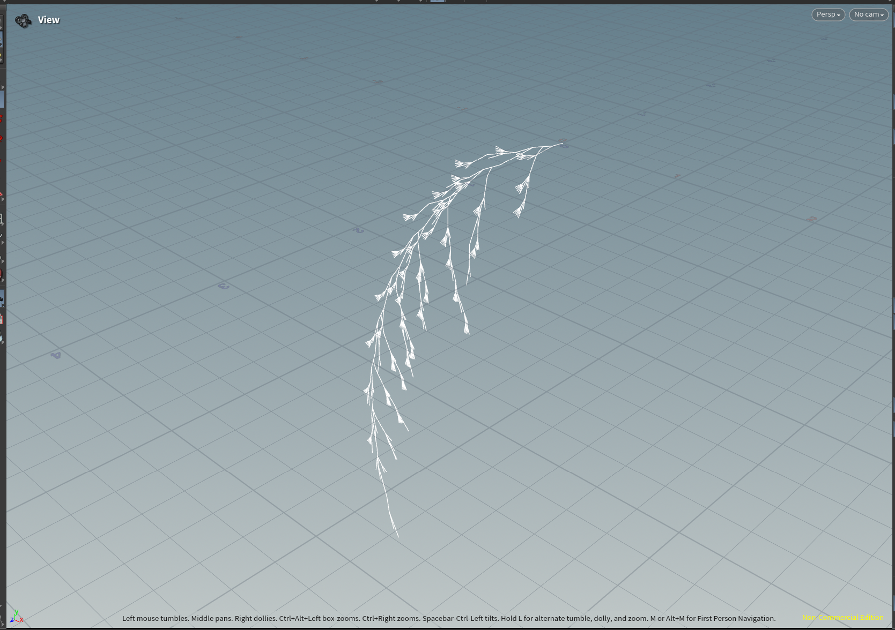
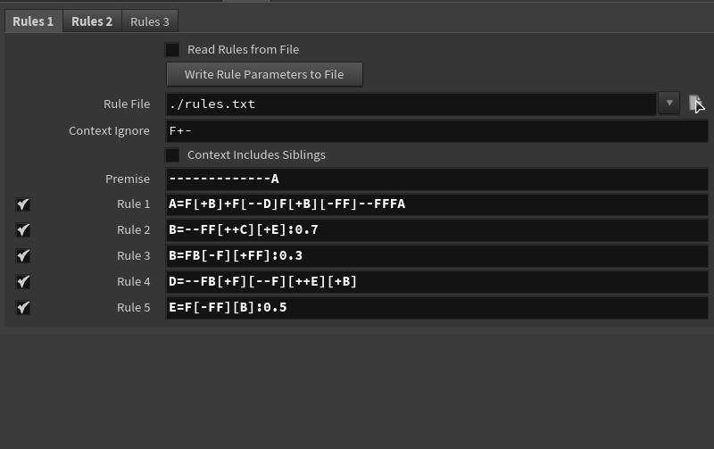
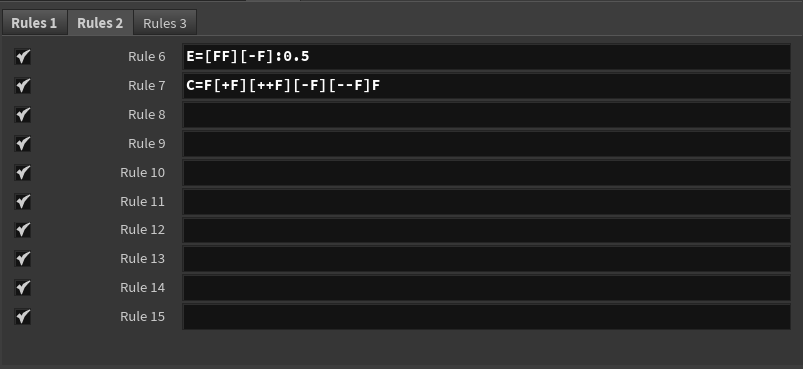

# lab04-grammars

Let's practice using grammars! For this lab, please pull up the L-system node in Houdini.

## 1. Wheat grammar puzzle

  
  
  
  
  

## 2. Square grammar puzzle

  
  
  
  
  

## 3. Custom plant

Choose a plant in the world. Working off a reference, design a grammar that mimics the structure of that plant. Unlike our simple puzzles, please use multiple rules for greater complexity. Think carefully about the structure of your grammar! EXPLAIN the structure of your plant in the README. What are the components? What do each of the rules do? Be sure to also include images of a few iterations of your output plant.

I tried to replicate this sakura branch... it's not the most accurate but I did do my best. And I added some "blossoms" as well through it.

<table align="center">
  <tr>
    <td align="center"><b>Iteration 2</b></td>
    <td align="center"><b>Iteration 4</b></td>
  </tr>
  <tr>
    <td></td>
        <td></td>
  </tr>
  <tr>
    <td align="center"><b>Iteration 6</b></td>
    <td align="center"><b>Iteration 8</b></td>
  </tr>
  <tr>
    <td></td>
    <td></td>
  </tr>
  <tr>
    <td align="center"><b>Iteration 10</b></td>
  </tr>
  <tr>
    <td></td>
  </tr>
</table>

  
  

