# lab04-grammars

Let's practice using grammars! For this lab, please pull up the L-system node in Houdini.

## 1. Wheat grammar puzzle

Look at these iterations (n = 1, 2, 3) of a one-rule grammar. Using the built in symbols in Houdini, design a grammar that produces this output. Take a screenshot of your rules.\

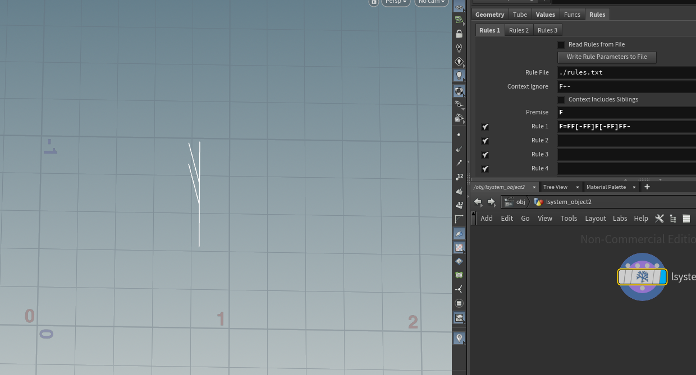

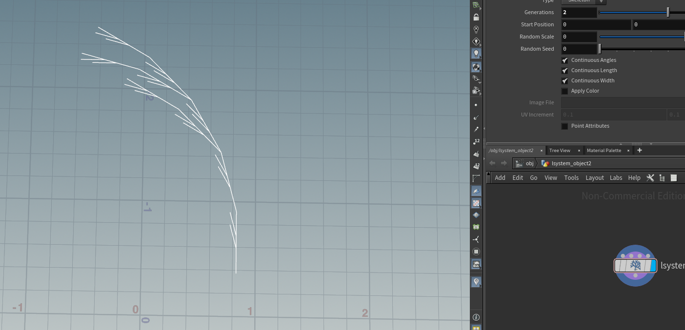

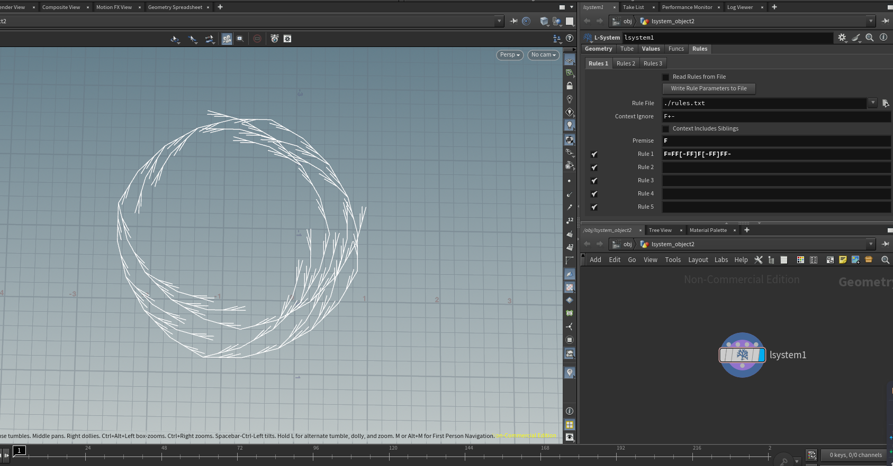

## 2. Square grammar puzzle

How about this one? Take a screenshot of your rules.\

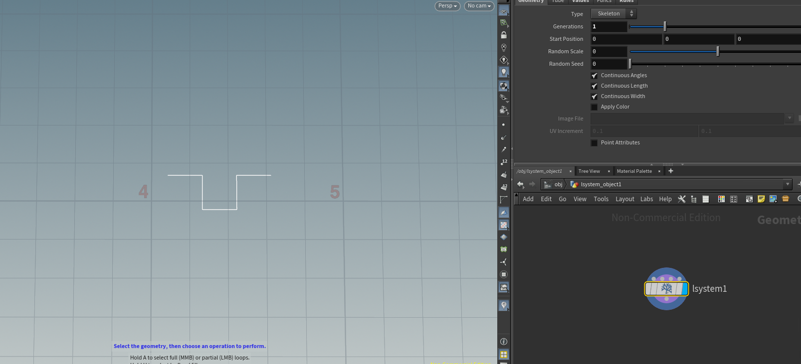

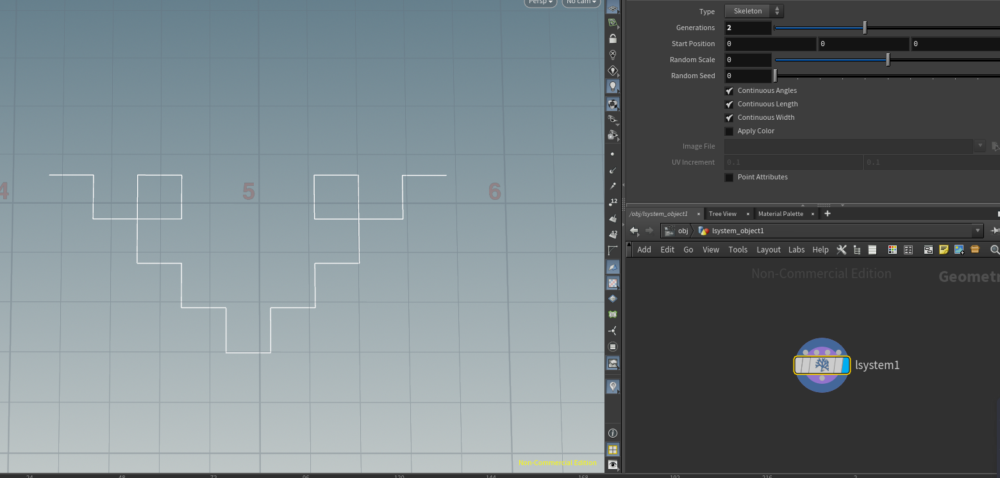

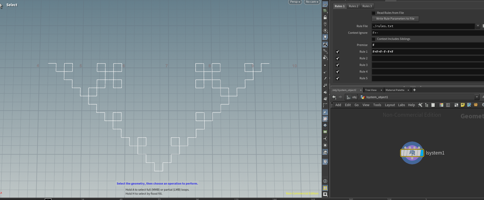

## 3. Custom plant

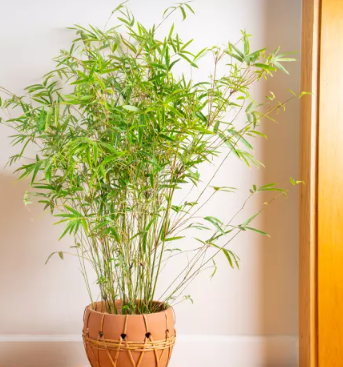

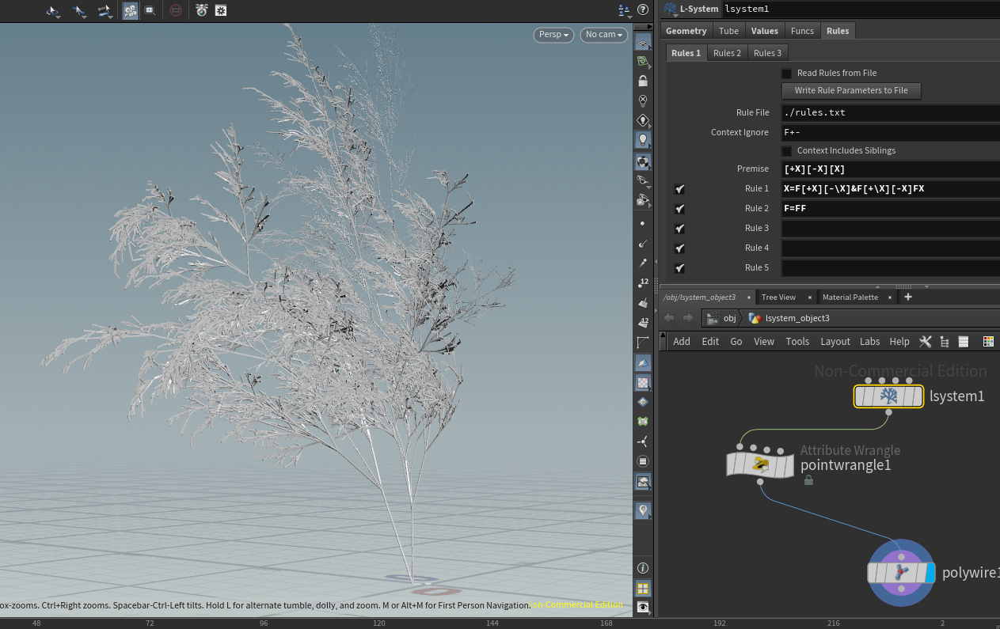

Choose a plant in the world. Working off a reference, design a grammar that mimics the structure of that plant. Unlike our simple puzzles, please use multiple rules for greater complexity. Think carefully about the structure of your grammar! EXPLAIN the structure of your plant in the README. What are the components? What do each of the rules do? Be sure to also include images of a few iterations of your output plant. 

### **Axiom `[+X][-X][X]`**

The brackets `[` and `]` save and restore the current turtle state (position and orientation).  
The `+` turns the heading to the left by the specified angle, and `-` turns it to the right.  
Together, `[+X][-X][X]` generates three main stems from the same base point — one turning left, one right, and one growing straight ahead.

---

### **Rule 1 `X = F[+X][-\X]&F[+\X][-X]FX`**

`F` moves the turtle forward, drawing one segment of the stem.  
`[+X]` creates a branch rotated left, while `[-\X]` creates a branch rotated right and rolled left (`\`) so that branches are distributed around the axis rather than lying in a single plane.  
`&` pitches the heading downward, making the next branches slightly droop.  
The following `F` moves forward again, `[+\X][-X]` generates another left–right pair of branches, then `F` advances once more before `X` recursively calls itself to continue growth.  

---

### **Rule 2 `F = FF`**

`F` means “move forward.”  
Replacing it with `FF` doubles the forward step distance, effectively elongating each internode and producing taller, more slender stems characteristic of bamboo-like growth.

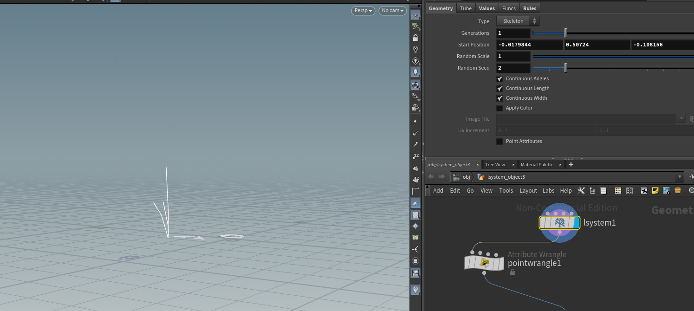

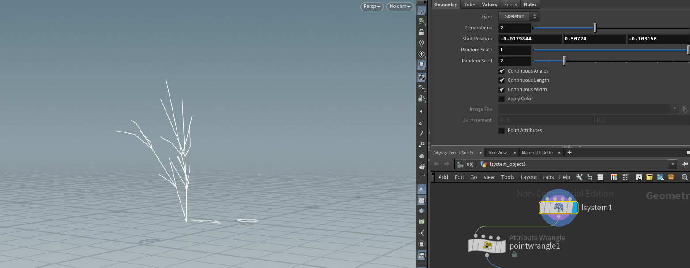

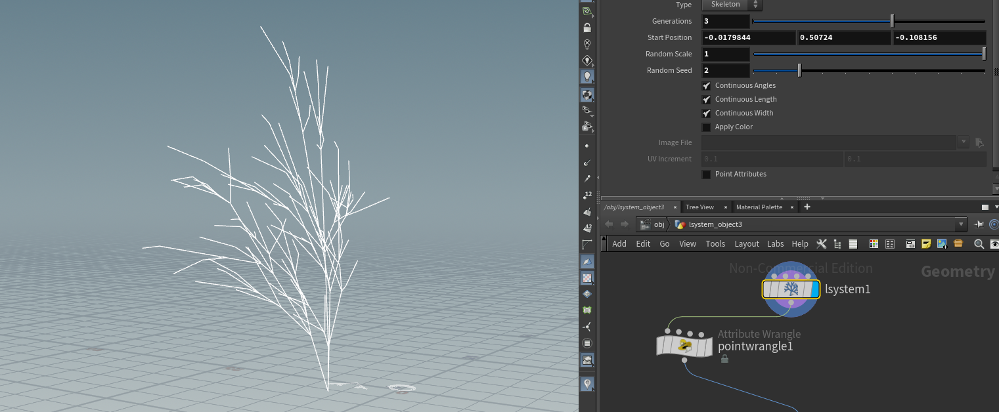

## Submission

- Create a pull request against this repository
- In your readme, list your solutions and format your README nicely
- Profit
